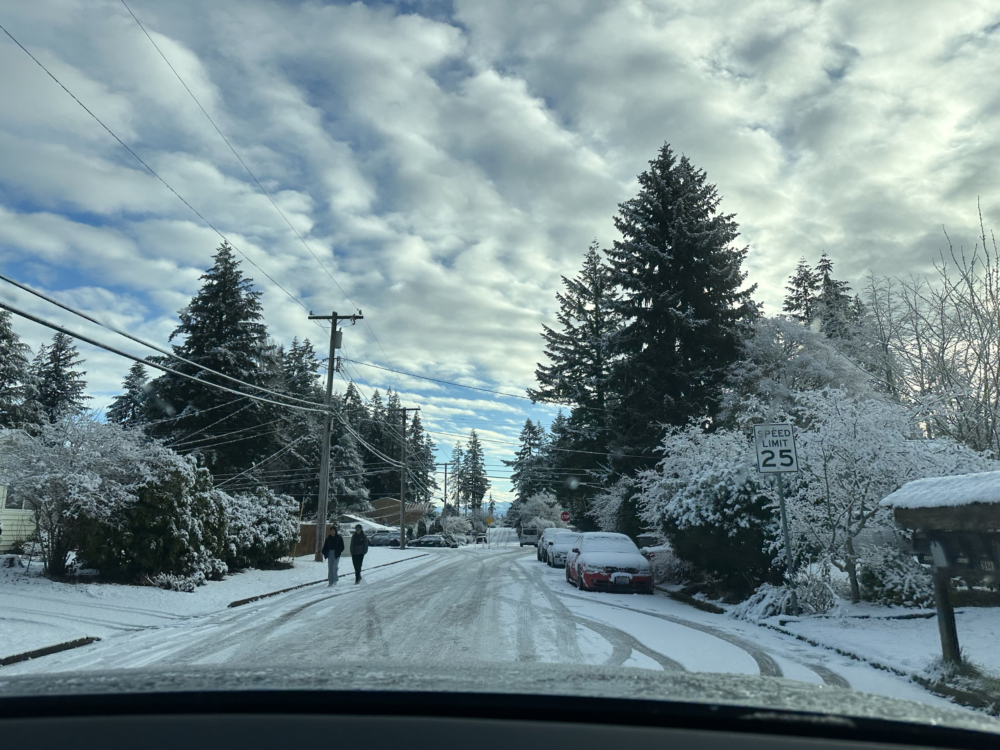
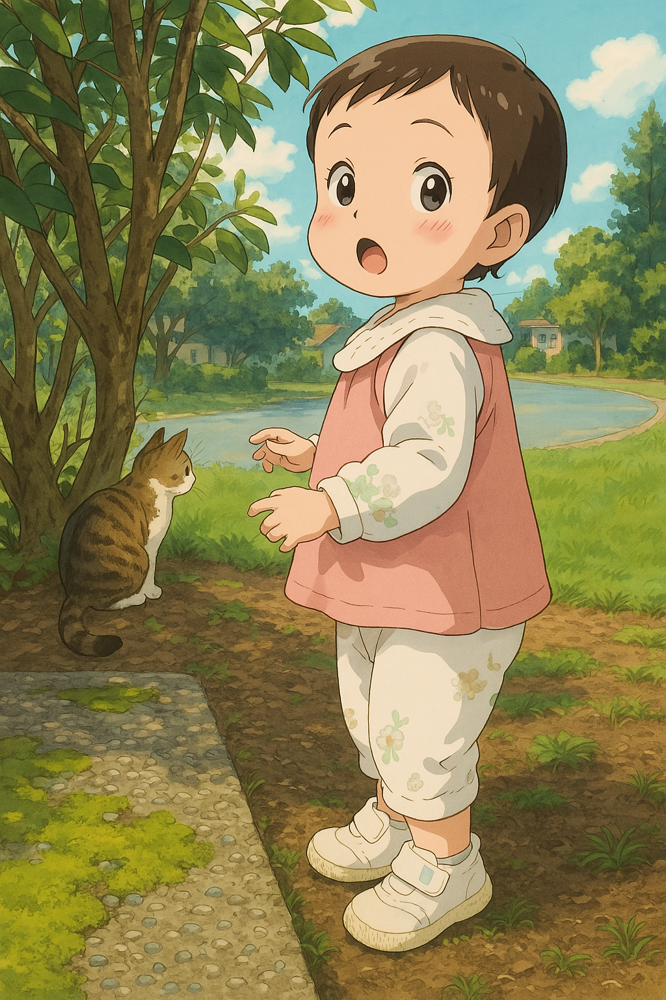

# My First Year in the US

It's been over a year since I came to the US. Looking back, it's been quite a roller coaster — so much has happened that I feel I need to write something down to capture this year.

## Winter

I arrived in the US in winter, and winter was all about adapting to a new life. Apartment hunting, getting a driver's license, buying a car, grocery shopping, cooking, taking care of my kid, buying furniture, assembling furniture — that was my daily routine for the first three months. What stands out most is learning to drive. I had a Chinese driver's license but had never actually driven. In the US, you can't go anywhere without a car, so getting my license became top priority. Practice went smoothly — I practiced the test route for two days and went for the test. The first road test, I was super nervous, felt like I couldn't focus on everything at once, drove hesitantly. Unsurprisingly, I failed — violated the rules by drifting into the opposite lane in a neighborhood. Straight fail. I practiced a few more days, felt more confident, and quickly scheduled the second test. Same examiner, a Russian guy. The drive went pretty smoothly. Back at the driving school, feeling confident and ready to parallel park, the examiner said "just pull into the parking lot." The moment I heard that, disappointment washed over me. I knew I'd failed again. Later he explained I failed because I didn't stop at a stop sign in the neighborhood. I was shocked — "But I did stop!" He said there were two consecutive stop signs, and I only stopped at one. I had zero memory of the second stop sign. Looking back, I realized my attention was all on test techniques — signal when starting, which way to turn the wheel when parking on a hill — no mental bandwidth left to notice road signs. Failing twice was pretty frustrating. I'd practiced seriously, why couldn't I pass? Plus I was waiting for the license to get insurance, which added some anxiety. After calming down, I thought about it and realized the root cause was just not being familiar with driving. So I decided not to rush into another test and just practice more. For the next month I practiced during commutes and slowly started to get the feel. A month later, I scheduled the third test. Same guy again. He recognized me and smiled, saying "let's try one more time, if it doesn't work you should switch examiners." The third test I was much more relaxed. The guy was really nice, making jokes along the way to help me relax. Finally passed! Pulled into the parking lot, so happy. I remember that day was one of those rare sunny days, my mood as clear and cloudless as the sky.

## Spring

After settling in during the first three months, my attention gradually shifted to work, and what I felt was a huge shock. Back in China, I'd worked with plenty of American colleagues and always thought their work was pretty chill. Coming here, I discovered the reality was vastly different from my expectations. There's a big difference between Chinese and American work cultures, and with AI's impact on the industry, work at big US tech companies is no longer chill — layoffs, overtime, complaining about work became common topics in casual conversations. Spring passed in a blur of busy overtime. Weeknights were either taking care of my kid or working late, weekends were hiking nearby, digging for oysters, visiting national parks — I didn't miss the beauty of spring.

Shortly after taking this photo, my cat went missing. My cat who had been with me for eight years, one day just disappeared without saying goodbye. Feifei, thank you for keeping me company all these years. I miss you so much. Wherever you are, I hope you find peace.

## Summer

Before coming to Seattle, friends who had lived here told me, "You love the outdoors so much, you'll definitely love Seattle. The summer here is amazing." Seattle's summer is truly beautiful — pleasant weather, long daylight hours, the sky doesn't get dark until almost 10 PM. Everyone's busy hiking, playing in the water, crabbing, visiting Rainier, fully enjoying nature's gifts.

My state of mind in summer could be captured by one song lyric: "Outside there's orange California sunshine, but I'm hiding in my own lonely black hole." I burned out in the summer. There were many reasons — moving to a new country consumed so much mental energy, then the company started layoffs, projects were difficult, couldn't adapt to so many things, plus I have high standards for myself. Under all this pressure, I burned out, fell into acute anxiety and depression. During that time I didn't want to go to work, didn't want to get out of bed, every day trapped in self-doubt with no way out. Felt like I was stuck, that America was the cage trapping me, that AI was the root of all evil. The turning point came in August when I went back to China. Back home, my family wrapped me in warmth and love. My hometown, an 18th-tier small county deep in the Qinling Mountains, caught my rapidly falling self with its ease and calm. In the US, every day I was facing rapidly evolving AI technology, social media full of news about how AI development was causing XX company to lay off more people, always worrying about work or worrying about cooking, constantly shrouded in anxiety and busyness, no respite. My hometown felt like a parallel world, nothing to do with AI, nothing to do with anxiety, running steadily in its own way. The town's residents wake up early to exercise, buy groceries, cook, take afternoon naps, small gatherings, evenings gathering in the square to cool off and dance. None of the big city's noise and restlessness has anything to do with this place. And I'd been soaking in that noise for so long, I'd forgotten there were different worlds. Seeing my family, everyone's life has its difficulties, but everyone is living earnestly. It struck me — from a small town to Xi'an, Xi'an to Beijing, Beijing to Seattle, I've been very fortunate, I already have so much. Family, friends, health — these are what truly matter. Compared to these, everything else that goes up and down is just passing clouds, why let it disturb my peace?

Looking back, it sounds light and breezy, but being in it was quite painful. I'm very grateful — with the support of family and friends, and help from a professional therapist, I adjusted pretty quickly. So I want to share these feelings. During my darkest times, Xiaohongshu gave me a lot of anxiety, but also gave me a lot of help. I found so much resonance and support in @Anna's burnout collection.

If you're also going through burnout, anxiety, depression, feeling like the world is all dark, be patient, believe that the difficulties in front of you aren't everything, the world is vast.

I'll end with a line from the Diamond Sutra: All conditioned phenomena are like dreams, illusions, bubbles, shadows; like dew and like lightning. Thus should you view them.

## Fall

Fall's story doesn't have dramatic ups and downs, but rather quiet, slowly growing strength.

Late summer, I returned to the US and went back to work. Those two weeks back in China, I accumulated so much love and energy, like planting a seed in my heart. Saying goodbye to family and friends, pulling my heavy suitcase, once again I embarked on the journey alone. I knew for myself and for my family, I needed to pull myself together, couldn't keep getting lost in self-pity. The seed was planted, I needed to water it and fertilize it with each day's living, let it slowly grow.

When I first got back, there was one vivid image: I was still taking antidepressants, and one day while taking my medicine, I quietly told myself, the days ahead might be really hard to endure, just grit your teeth and get through it, one day at a time, you'll definitely make it through. I was prepared for a harsh winter, but discovered unexpectedly that it wasn't that cold — fall was beautiful. After coming back, the daily routine continued, work, taking care of my kid, but different from before, I arranged lots of activities for myself — playing tennis, attending social events, meeting old classmates, forcing myself to get out there. Just like that, one day at a time, one week at a time, life passed steadily. Got more and more comfortable at work, gradually figured out patterns in daily life, able to squeeze out a little time for myself in the busy routine. One day it suddenly occurred to me, I hadn't taken my medicine for two weeks. I knew I was recovering.

Throughout this process I kept playing tennis. In Seattle's beautiful, crisp fall, running around the court, breaking a sweat, focusing on each stroke, every time I got on the court it let me slow down, find peace. I really like the feeling of hitting forehands. Someone said this motion is similar to primitive humans using clubs to strike prey skulls, it releases dopamine.

I also read a lot of books, mainly focused on psychology, history, and Buddhism. In 2025 I read 50 books, the most I've read in years. Reading, listening to podcasts, thinking, keeping a journal — these things I've loved since I was little, I found them again. These little things nourish me too, help me rediscover myself.

Looking back, this year's ups and downs taught me a lot. I'm more confident, understand better what kind of person I am, where my boundaries are, what I can accept and what I can't. This brought many changes. In life I started letting go of some things, like no longer being obsessed with cooking every day. I don't know why, but coming to America I developed this obsession with cooking. But I'm not good at cooking, and cooking every day is really hard. Have to think about grocery shopping and ingredients (often can't get everything at one store), nutritional balance, and cooking is like a systems engineering project — coordinating different tasks, like washing and cutting vegetables, different pots, making a table of decent meat and vegetable dishes in 40 minutes, it's really not easy! And after a while you need to switch things up, eating the same thing every day gets boring. Before summer, cooking felt like a task, taking up part of my bandwidth every day. After letting go of this obsession, I relaxed a lot. Cooking less often, I actually enjoy the cooking process more, finally have the mood to research what I want to eat and love to eat, my cooking skills have even improved.

The change at work is that I'm no longer afraid of conflict. I'm good at empathy, naturally understand others' difficulties, but the old me wasn't good at drawing boundaries, which caused me quite a bit of trouble. After going through summer's low point, I'm no longer afraid of conflict — I've already been completely shattered, how much worse could it get? I discovered I can firmly express myself in conflict, better identify my own and others' emotions. After successfully resolving several conflicts, I was pleasantly surprised to discover: conflict can also be an opportunity to improve collaboration, turns out what the books say is true :)

Since fall and winter, I've been thinking a lot about myself, AI, history, Buddhism. Hope to have a chance to expand on these thoughts in the future.

Looking back at this year, it really was stepping out of my comfort zone. From getting hit hard to gradually finding direction, finding my own strength. This journey was worth it. Grateful for my family and friends who accompanied and supported me along the way. I hope in the new year to stay healthy, keep reading, thinking, playing tennis, keep writing and sharing.
